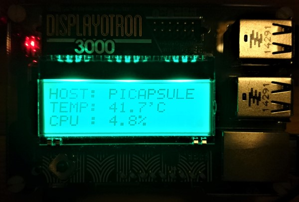

# PI Info

**PI Info** is a Python 3 script showing system information on a Display-O-Tron 3000. Use the joystick to navigate between screens. The backlight can be turned on/off via joystick push.

*Screen1: Hostname, Temperature, CPU Utilization
*Screen2: IP Address
*Screen3: Disk Usage
*Screen4: Internet Status

## Quickstart guide

Setup the Display-o-Tron by following the instructions on the Pimoroni site located [here](https://learn.pimoroni.com/tutorial/display-o-tron/getting-started-with-display-o-tron "Getting started with Display-o-Tron 3000").

For the impatient: 

    curl https://get.pimoroni.com/displayotron | bash

**References:**
* [Pimoroni Display-o-Tron 3000 Reference](https://learn.pimoroni.com/tutorial/display-o-tron/getting-started-with-display-o-tron)
* [Display-o-Tron 3000 product reference on the PiHut](https://thepihut.com/products/pimoroni-display-o-tron-3000)
